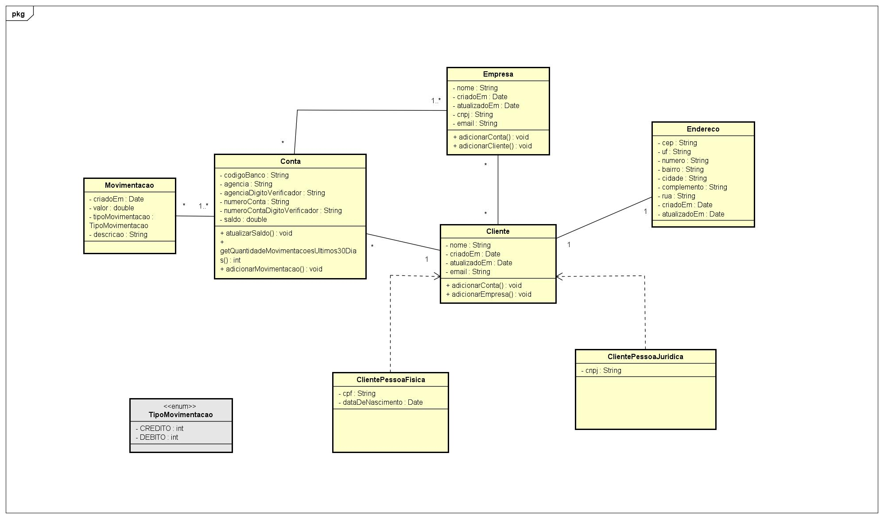
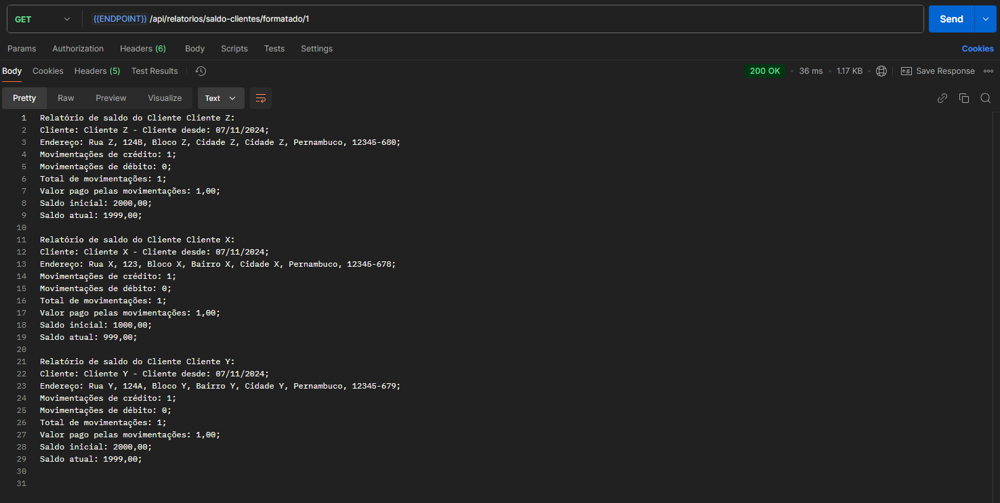

# Projeto DesafioMV

## Visão Geral

Este projeto é uma aplicação Java desenvolvida utilizando o framework Spring, Maven para gerenciamento de dependências e SQL para persistência de dados utilizando o banco de dados `Oracle` e a linguagem `PL/SQL` para criação de packages e procedures. A aplicação gerencia entidades como `Cliente`, `Empresa` e `Conta`, e fornece serviços para gerar relatórios de saldo de clientes.

## Estrutura do Projeto

A estrutura do projeto é organizada da seguinte forma:

- `src/main/java/com/desafiomv/desafiomv/entities`: Contém as classes de entidade que representam as tabelas do banco de dados.
- `src/main/java/com/desafiomv/desafiomv/repositories`: Contém as interfaces de repositório que estendem `JpaRepository` para acesso aos dados.
- `src/main/java/com/desafiomv/desafiomv/services`: Contém as classes de serviço que encapsulam a lógica de negócios.
- `src/main/java/com/desafiomv/desafiomv/dtos`: Contém as classes DTO (Data Transfer Object) usadas para transferir dados entre camadas.
- `src/main/java/com/desafiomv/desafiomv/controllers`: Contém as classes de controlador que expõem endpoints REST.

## Diagrama de classes



## Boas Práticas de Desenvolvimento

1. **Organização do Código**: O código está organizado em pacotes conforme a responsabilidade de cada classe, seguindo o padrão MVC (Model-View-Controller).
2. **Injeção de Dependências**: Utilizamos a injeção de dependências do Spring para gerenciar as dependências entre os componentes, promovendo um código mais modular e testável.
3. **Tratamento de Exceções**: Exceções são tratadas de forma adequada, lançando exceções específicas como `ObjectNotFoundException` quando uma entidade não é encontrada.
4. **Uso de Anotações**: Anotações do JPA e Jackson são usadas para mapear entidades e gerenciar a serialização/deserialização JSON.
5. **Imutabilidade**: Utilizamos coleções imutáveis sempre que possível para evitar efeitos colaterais indesejados.
6. **Documentação**: Métodos e classes são documentados para facilitar a manutenção e entendimento do código.
## Padrões de Projeto Utilizados

1. **Repository Pattern**: Utilizamos o padrão Repository para abstrair a lógica de acesso a dados, permitindo que a lógica de negócios não dependa diretamente da camada de persistência.
2. **Service Layer Pattern**: A camada de serviço encapsula a lógica de negócios, promovendo a separação de responsabilidades e facilitando a manutenção e testes.
3. **DTO (Data Transfer Object)**: Utilizamos DTOs para transferir dados entre a camada de serviço e a camada de apresentação, evitando expor diretamente as entidades do domínio.
## Exemplo de Código

### Entidade Cliente

```java
@Entity
@Table(name = "clientes")
public class Cliente {
    // Atributos e mapeamentos JPA
    // Construtores, getters e setters
}
```

### Serviço RelatorioService

```java
@Service
public class RelatorioService {
    // Injeção de dependências e métodos de serviço
}
```

### Repositório EmpresaRepository

```java
public interface EmpresaRepository extends JpaRepository<Empresa, Long> {
    // Métodos de acesso a dados
}
```

### Controlador ClienteController

```java
@RestController
@RequestMapping("/api/clientes")
public class ClienteController {
    // Endpoints REST
}
```

### Interface TaxaCobranca
Define a regra de cobrança baseada na quantidade de movimentações. Pode ser implementado como uma interface para que seja flexível a criação de novos planos, se necessário.
```java
public interface TaxaCobranca {

    BigDecimal calcularTaxaCobrancaPorMovimentacao(int quantidadeMovimentacoes);
}
```

## Tratamento de Exceções
Classe responsável por capturar todas as exceções lançadas pelos controladores e tratar de forma adequada, retornando uma resposta HTTP com o status e corpo apropriados.
```java
@ControllerAdvice
public class ControllerExceptionHandler {

    public static final String TIME_ZONE = "America/Sao_Paulo";

    @ExceptionHandler({MovimentacaoInvalidaException.class})
    public ResponseEntity<ErroPadraoDto> handleMovimentacaoInvalidaException(MovimentacaoInvalidaException e, HttpServletRequest request) {
        var body = new ErroPadraoDto(ZonedDateTime.now(ZoneId.of(TIME_ZONE)), HttpStatus.BAD_REQUEST.value(), "Erro na movimentação", e.getMessage(), request.getRequestURI());
        return ResponseEntity.status(HttpStatus.BAD_REQUEST).body(body);
    }
    // Outros métodos para tratar exceções
}
```

## Exemplo de relatório gerado pela aplicação
- Relatório formatado


- Relatório JSON
```json
[
    {
        "nome": "Cliente X",
        "dataCadastro": "07/11/24 08:55:57,695346 -03:00",
        "logradouro": "Rua X",
        "numero": "123",
        "complemento": "Bloco X",
        "bairro": "Bairro X",
        "cidade": "Cidade X",
        "estado": "Pernambuco",
        "cep": "12345-678",
        "movimentacao_credito": 1,
        "movimentacao_debito": 0,
        "taxa_servico": 1,
        "saldo_inicial": 1000,
        "saldo_final": 999
    },
    {
        "nome": "Cliente Z",
        "dataCadastro": "07/11/24 08:55:57,822333 -03:00",
        "logradouro": "Rua Z",
        "numero": "124B",
        "complemento": "Bloco Z",
        "bairro": "Cidade Z",
        "cidade": "Cidade Z",
        "estado": "Pernambuco",
        "cep": "12345-680",
        "movimentacao_credito": 1,
        "movimentacao_debito": 0,
        "taxa_servico": 1,
        "saldo_inicial": 2000,
        "saldo_final": 1999
    },
    {
        "nome": "Cliente Y",
        "dataCadastro": "07/11/24 08:55:57,777191 -03:00",
        "logradouro": "Rua Y",
        "numero": "124A",
        "complemento": "Bloco Y",
        "bairro": "Bairro Y",
        "cidade": "Cidade Y",
        "estado": "Pernambuco",
        "cep": "12345-679",
        "movimentacao_credito": 1,
        "movimentacao_debito": 0,
        "taxa_servico": 1,
        "saldo_inicial": 2000,
        "saldo_final": 1999
    }
]

```

## Conclusão

Este projeto segue boas práticas de desenvolvimento e utiliza padrões de projeto reconhecidos para garantir um código limpo, modular e fácil de manter. A estrutura do projeto facilita a escalabilidade e a adição de novas funcionalidades.